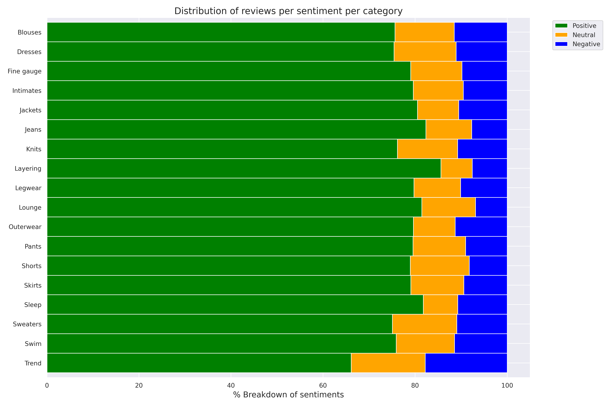

# Amazon's Product Review Sentiment Classification

# [Ingest, Transform & Visualize Data with AWS](https://github.com/rkshiyaniya/Amazon-Product-Review-Sentiment-Classification/blob/main/Ingest%2C%20Transform%20and%20Visualize%20Data%20with%20AWS.ipynb)

## Here's some Screenshots of Analysis

### Number Of Reviews per Category

### Distribution of Number Of Words per Review

### Average Sentiment per Category

### Distribution of Sentiment per Category

## [Raw Data](https://github.com/rkshiyaniya/Amazon-Product-Review-Sentiment-Classification/blob/main/womens_clothing_ecommerce_reviews.csv)

## [Transformed Data](https://github.com/rkshiyaniya/Amazon-Product-Review-Sentiment-Classification/blob/main/womens_clothing_ecommerce_reviews_transformed.csv)

# [Statistical Bias Detection in Dataset and Balanced it](https://github.com/rkshiyaniya/Amazon-Product-Review-Sentiment-Classification/blob/main/Detect%20data%20bias%20with%20Amazon%20SageMaker%20Clarify.ipynb)

### [Report Of Unbalanced Data](https://github.com/rkshiyaniya/Amazon-Product-Review-Sentiment-Classification/blob/main/unbalanced_report.pdf)

## [Balanced Data](https://github.com/rkshiyaniya/Amazon-Product-Review-Sentiment-Classification/blob/main/womens_clothing_ecommerce_reviews_balanced.csv)

### [Report Of Balanced Data](https://github.com/rkshiyaniya/Amazon-Product-Review-Sentiment-Classification/blob/main/balanced_report.pdf)

- [x] Built model using AutoML (FastText algorithm) with Amazon SageMaker Autopilot
- [x] Train Model using built-in BlazingText & BERT algorithms
