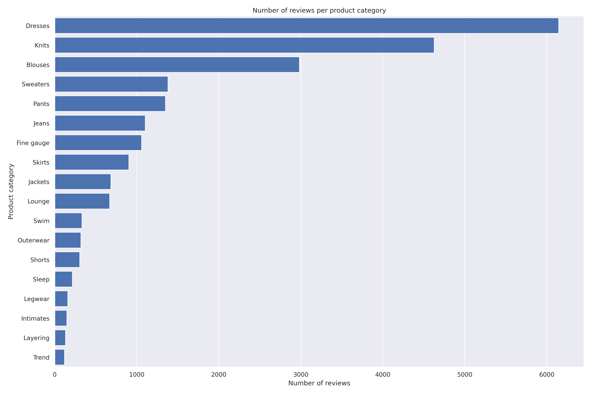
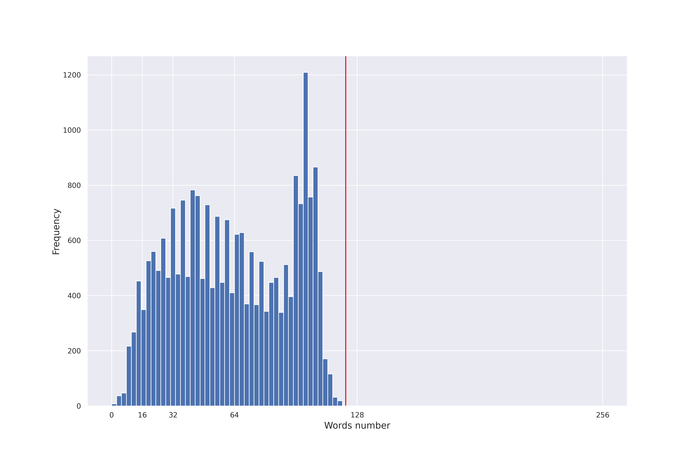
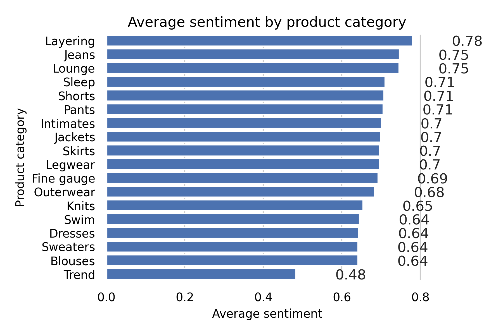

# Amazon's Product Review Sentiment Classification

- [x] [Ingest, Transform & Visualize Data with AWS](https://github.com/rkshiyaniya/Amazon-Product-Review-Sentiment-Classification/blob/main/Ingest%2C%20Transform%20and%20Visualize%20Data%20with%20AWS.ipynb)

## Here's sonme of SS from that notebook

### Number Of Reviews per Category

### Distribution of Number Of Words per Review

### Average Sentiment per Category

### Distribution of Sentiment per Category

- [x] Statistical Bias Detection in Dataset and Balanced it
- [x] Built model using AutoML (FastText algorithm) with Amazon SageMaker Autopilot
- [x] Train Model using built-in BlazingText & BERT algorithms
